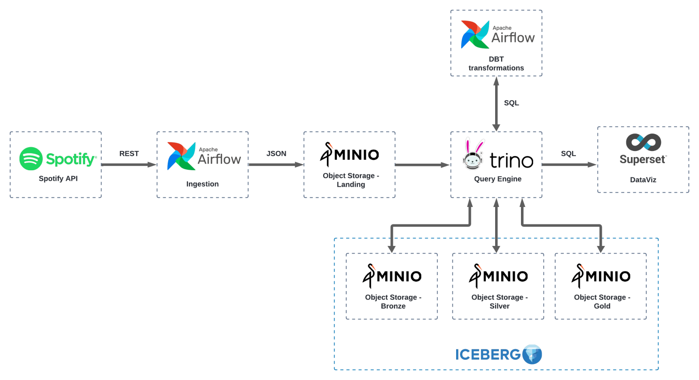

## Airflow Data Lake local

- Source: https://www.linkedin.com/pulse/criando-um-data-lake-de-baixo-custo-e-agn%25C3%25B3stico-com-dbt-outtes-msc--n2pvf/?trackingId=FdeH6JP36P26Z4FHDqKK3A%3D%3D
- Github: https://github.com/victorouttes/spotify_datalake

#### Commands:
- docker-compose up -d
- docker-compose down -v

#### Minio

- http://localhost:9000/
- user: minioadmin
- password: minioadmin123

#### Airflow

- http://localhost:8080/
- user: admin
- password: docker exec -it airflow cat standalone_admin_password.txt

#### Trino

- dbeaver connection url: jdbc:trino://localhost:8085
- user: admin

#### Superset

- http://localhost:8088/
- user: admin
- password: admin

#### DBT Manual

- https://www.youtube.com/watch?v=1fY1A8SRflI
- pip install dbt-trino
- install vscode dbt Power User extension
- mkdir $home\.dbt
- [cmd: from airflow\dags\dbt_project] dbt init
- change host=localhost and port=8085 in profiles.yml
- [cmd: from airflow\dags\dbt_project] dbt deps && dbt build --profiles-dir .

#### If the network is not found:

- docker-compose up -d --force-recreate